# .NET 8.0 - Clean Architecture using Repository Pattern and Dapper with Logging and Unit Testing #

### Introduction ###

This article covers the creation of a sample CRUD API in .NET 8.0 using clean architecture. [Read the full documentation here](https://dev.to/techiesdiary/net-60-clean-architecture-using-repository-pattern-and-dapper-with-logging-and-unit-testing-1nd9)

We will use the following tools, technologies, and frameworks in this sample:

- Visual Studio 2022 and .NET 8.0
- C#
- MS SQL DB
- Clean Architecture
	- The Clean Architecture is the system architecture guideline proposed by Robert C. Martin also known as Uncle Bob. It is derived from many architectural guidelines such as Hexagonal Architecture, Onion Architecture, etc.
- Dapper (mini ORM)
	- Dapper is a simple Object Mapper or a Micro-ORM and is responsible for mapping between database and programming language.
- Repository Pattern
- Unit of Work
- Swagger UI
- API Authentication (Key Based)
- Logging (using log4net)
- Unit Testing (MSTest Project)

### DB setup: ###
- Create a new table that will be used to perform the CRUD operation. You can use the scripts shared under the **CleanArch.Sql/Scripts** folder of the code sample.

### Solution and Project Setup: ###
- Once the back end is ready, Open Visual Studio 2022, and create a blank solution project, and name it **CleanArch**.
	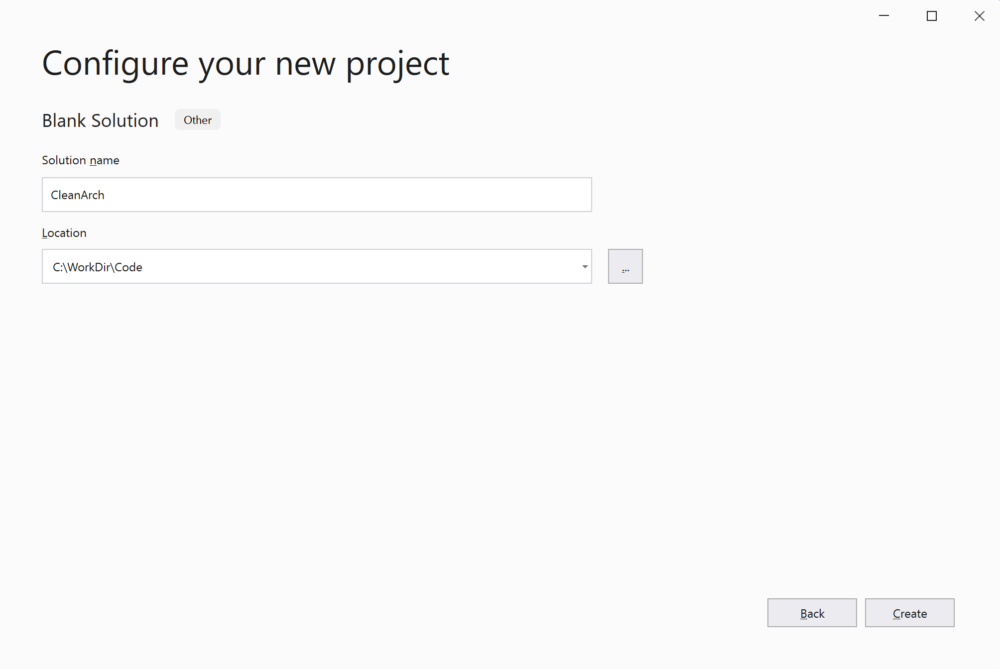

- **Set Up Core Layer:** Under the solution, create a new Class Library project and name it **CleanArch.Core**.
	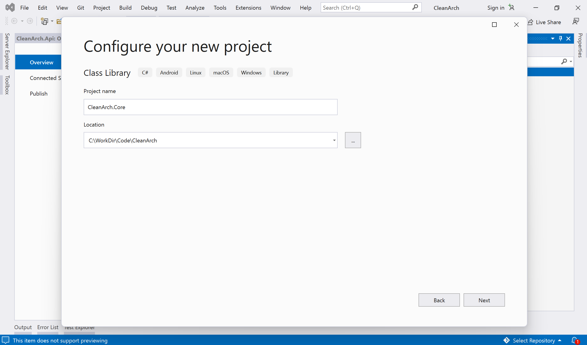

- **One thing to note down here is that the Core layer should not depend on any other Project or Layer. This is very important while working with Clean Architecture.**

- **Set Up Application Layer:** Add another Class Library Project and name it **CleanArch.Application**.
	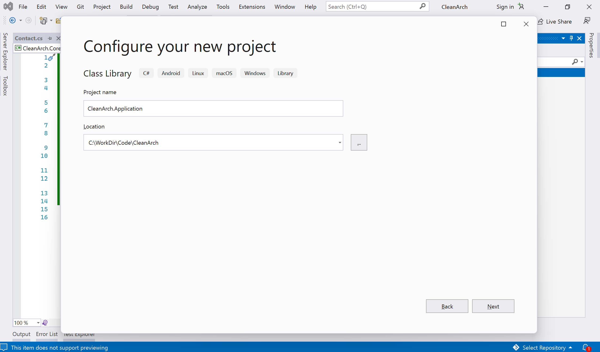

	- Add a reference to the **Core** project, The Application project always depends only on the **Core** Project.

- **Set Up Logging:** Add a new Class Library Project (**CleanArch.Logging**)
	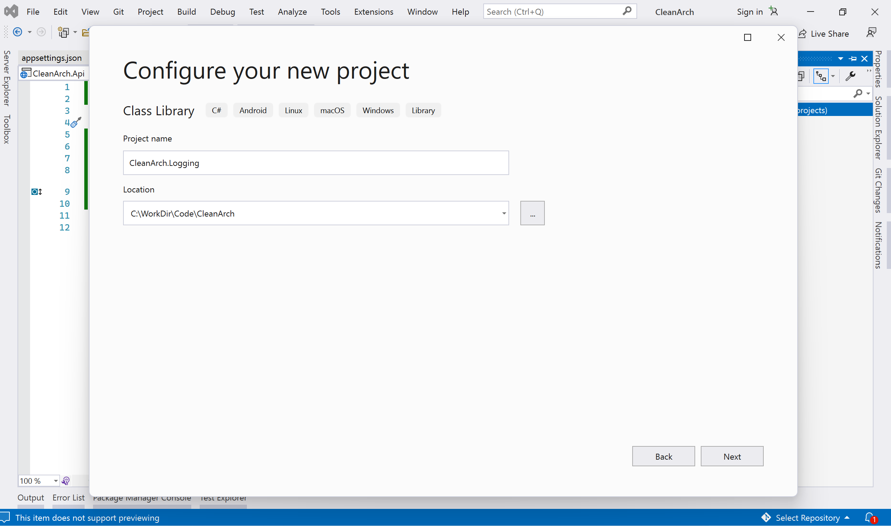

	- Install the **log4net** package from the NuGet Package Manager and add a reference to the **Application** project 

- **Set Up SQL Project:** Add a new Class Library Project (**CleanArch.Sql**). We’ll be using this project to manage the Dapper Queries.
	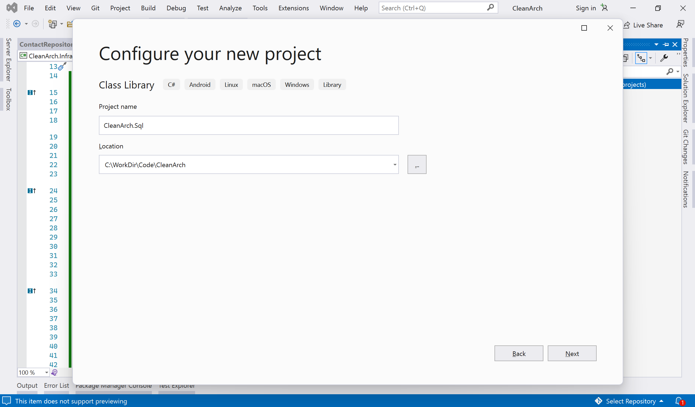
	
- **Set Up Infrastructure Layer:** Add a new Class Library Project and name it **CleanArch.Infrastructure**.
	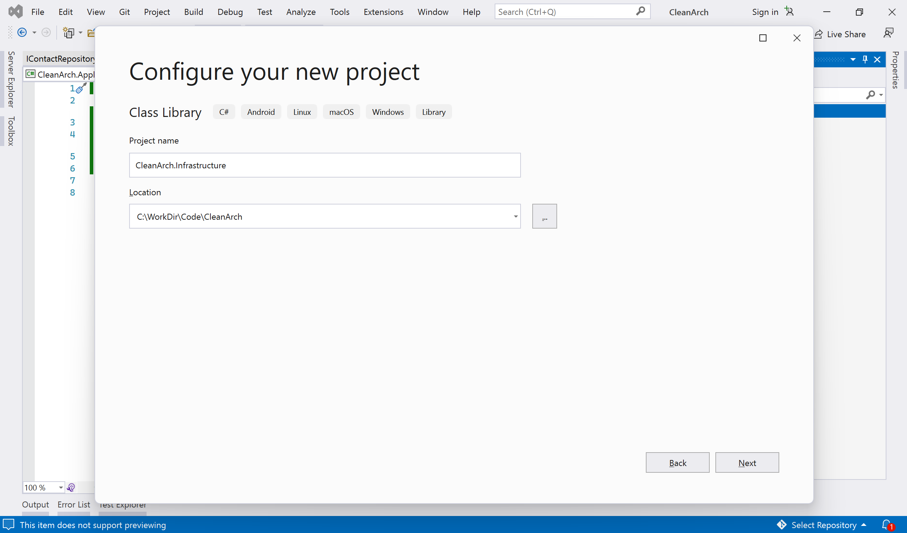

	- Add the reference to projects (**Application**, **Core**, and **Sql**), and also add a new folder **Repository**.

	- Add the required packages to be used in this project.
	>     Install-Package Dapper
	>     Install-Package Microsoft.Extensions.Configuration
	>     Install-Package Microsoft.Extensions.DependencyInjection.Abstractions
	>     Install-Package System.Data.SqlClient
		
- **Set up API Project:** Add a new .NET 8.0 Web API project and name it **CleanArch.Api**.
	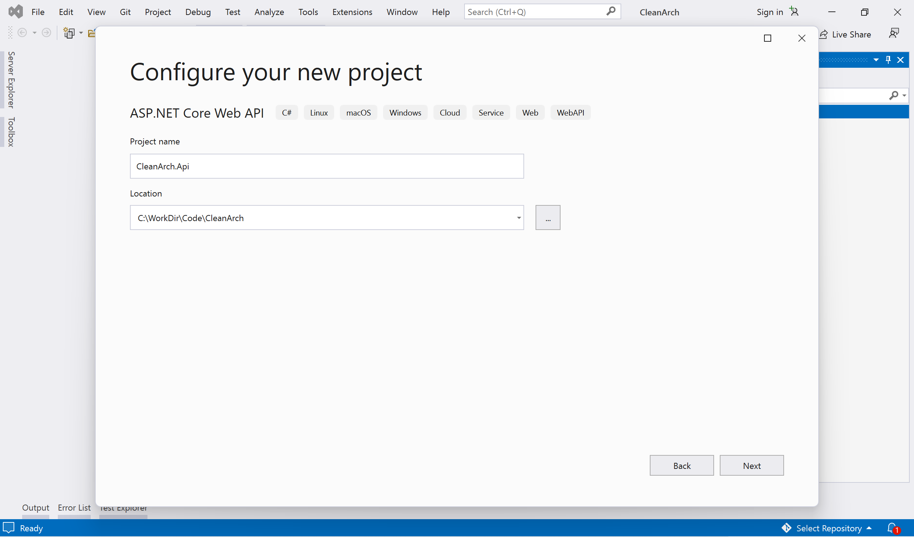
	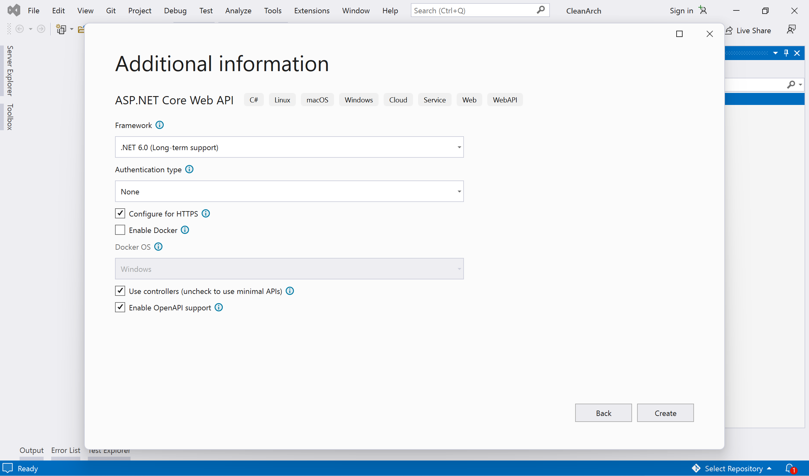
	
	- Add the reference to projects (**Application**, **Infrastructure**, and **Logging**), and also add the **Swashbuckle.AspNetCore** package.
	>     Install-Package Dapper
	>     Install-Package Microsoft.Extensions.Configuration
	>     Install-Package Microsoft.Extensions.DependencyInjection.Abstractions
	>     Install-Package System.Data.SqlClient

	- Set up the appsettings.json and log4net.config (for logging).
	- Configure Startup settings, such as RegisterServices (defined under **CleanArch.Infrastructure** project), configure log4net, and add the Swagger UI (with authentication scheme).
		- In .NET 8.0 all these settings will be done under Program.cs file and there is no need to add a separate Startup class.
	- Set up AuthorizationFilter and controllers.

- **Set up a Test Project:** Add a new MSTest Test project and name it **CleanArch.Test** and add the below packages.

	>     Install-Package Microsoft.Extensions.Configuration
	>     Install-Package MSTest.TestFramework
	>     Install-Package MSTest.TestAdapter
	>     Install-Package Moq

	

- Review the project structure in the solution explorer.
	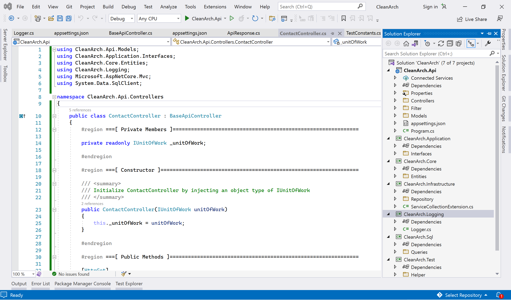

### Build and Run Test Cases: ###
- Build the solution and run the code coverage, this will run all the test cases and show you the test code coverage.
	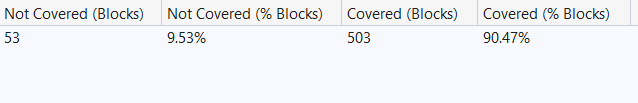

### Build and Run Test Cases: ###
Run the project and test all the CRUD API methods. (Make sure **CleanArch.Api** is set as a startup project)

- Swagger UI
	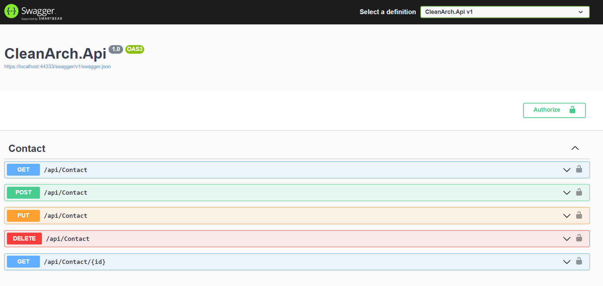

- Running API without authentication throws an error.
	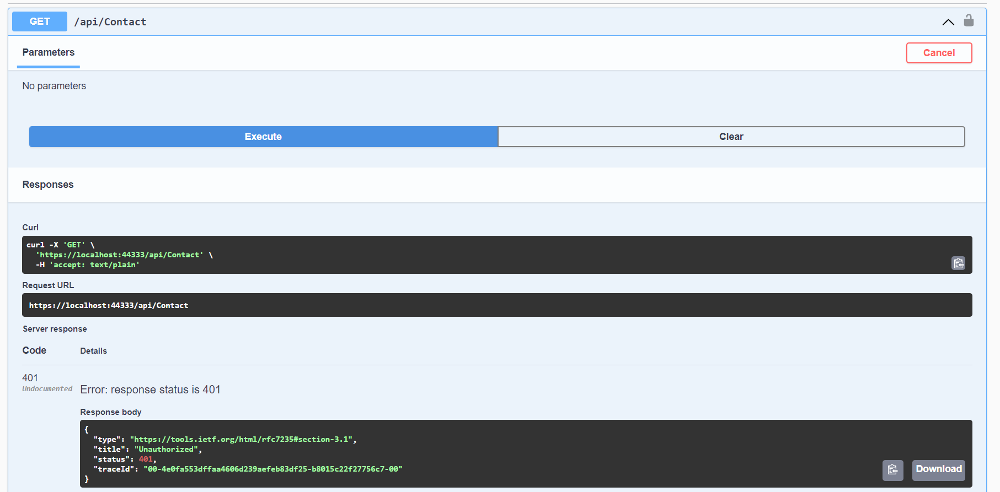

- Add API Authorization.
	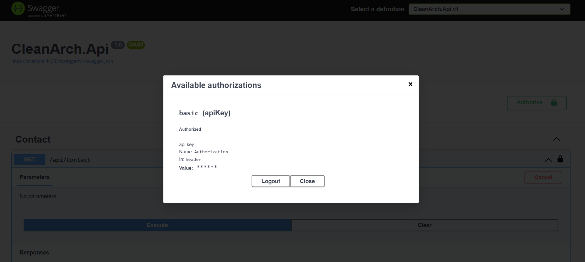

- **POST** - Add new record.
	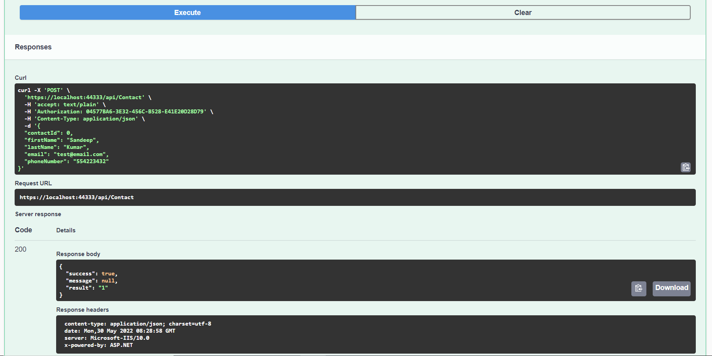

- **GET** - Get All records.
	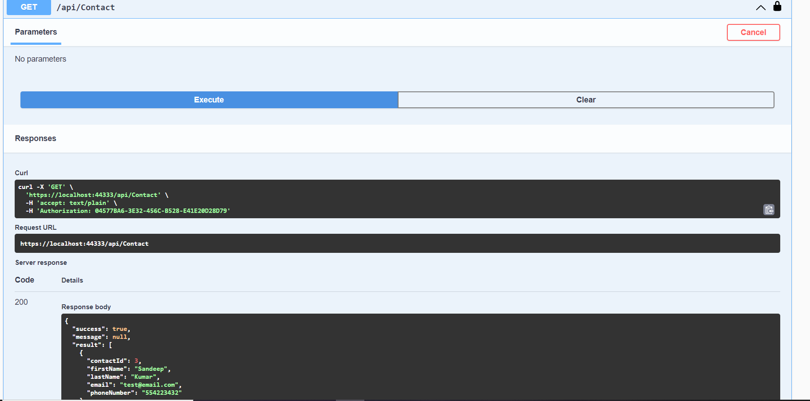

- **PUT** - Update the existing record.
	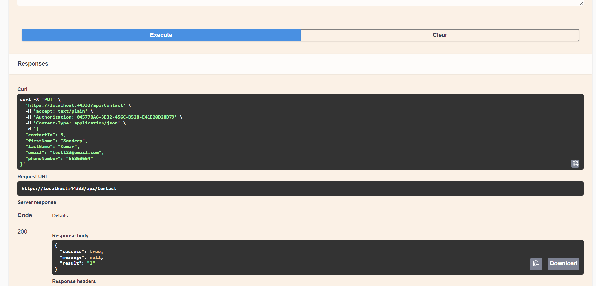

- **GET** - Get single record.
	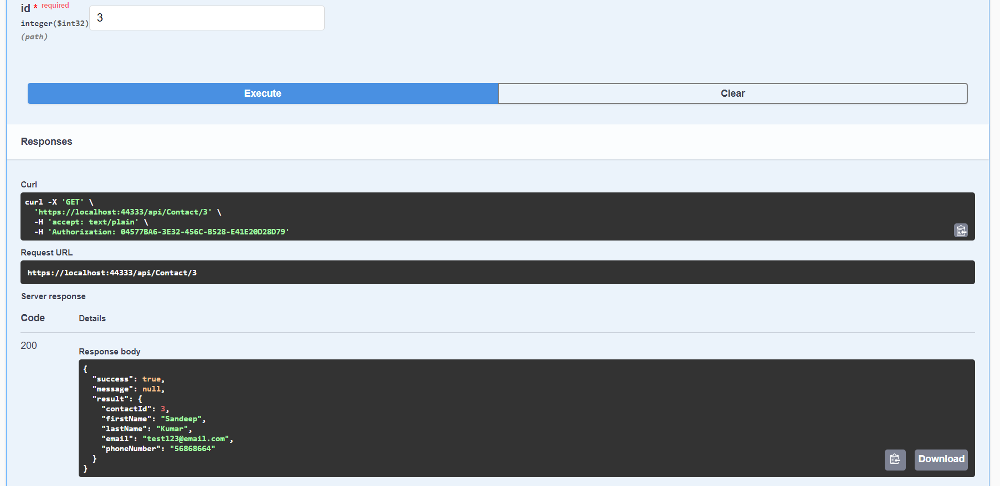

- **DELETE** - Delete the existing record.
	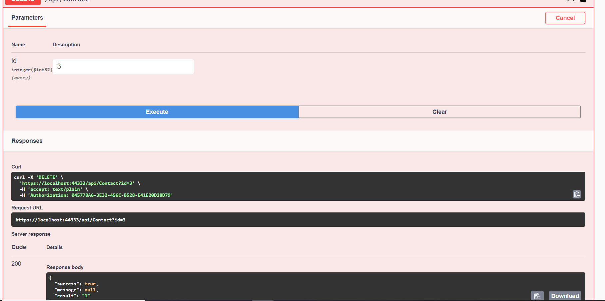

